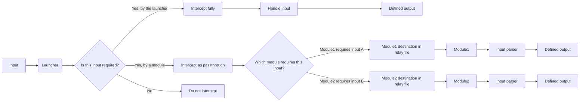

# Nemesis Project
A modular macro launcher platform built entirely in raw AutoHotKey v1.1.37.02

# Information
## What is Nemesis Project about?
We started off as a simple macro for a Roblox game under the name ZxMacro, but eventually became a whole platform, built on transparency and honesty. We want to supply a platform for AHK developers to collaborate and work together on making their own macros or utilities
## What is Nemesis Project?
Nemesis by itself is a transparency-first macro launcher platform running a modular file-relay system. The system consists of one main script (which is Nemesis itself) and several modules.
## How does Nemesis work?
Nemesis uses a file-relay system to communicate with its modules. The main script itself reads the hotkey inputs and sends them over to the modules that require those specific keybinds and execute outputs. The modules themselves aren't able to read user input. Alongside hotkey information, Nemesis also uses an array of commands to control the modules.
## Why was there a login system if Nemesis is free?
We used to be a paid software, so we made quite a few additions to secure the script. Nemesis required users to be registered into our public database before allowing them to use the platform. This has changed now, Nemesis can be accessed freely without registering
## What is this repository for then?
While we stay closed source, we will use this repositors as a source for our installer to clone from. Once we decide to go open-source, we'll publish all of our unobfuscated uncompiled code into this repository under the GNU Public License.
## How does Nemesis stay transparency-first while being closed source?
Initially, one would think transparency and closed-source are conflicting terms. We wish to change this approach. Nemesis itself sticks to its reputable past and avoids any sort of suspicious relations. Our main script and modules are carefully reviewed before published, ensuring that no malicious code is added. Our verification system works entirely locally and we use military-grade encryption for login data inside our database. Nothing leaves your device without your knowledge. Optional data is only sent with user consent. The only data we actively receive inside auth logs is your username, authorization hashes and login timestamp. Modules are also additionally validated to ensure that unauthorized modules aren't able to connect to our platform.
## What other projects does Nemesis Studios work on?
We have multiple open-source projects, both older and newer. Our current public list consists of: **RemappX** (keyboard remapping utility), **XORCrypt** (portable text encryptor tool) and **FileGovernor** (startup manager and launcher utility)
## What data are collected?
Nemesis constructs unique device IDs for every device that uses the launcher. Our logger includes the device ID and the login timestamps. Device IDs are only used for the ban system, they do not serve telemetry purposes.
  
# Installing and using Nemesis Project
## Installing and maintenace
Installing Nemesis can be done in multiple ways.  
1, You can clone the repository to acquire what we named a **local install media**. You can then run the installer and use the local install method. (This is more reliable on weaker, unstable networks)  
2, You can download the installer and use **Git** to install the files (the installer handles this as long as you have Git installed)  
3, You can download the installer and use **HTTP GET requests** to install the files (the installer also handles this as long as you're connected to the Internet)  
  
If you don't want to, or can't install Nemesis, it also supports **Portable mode**  
### Nemesis: Portable mode
Portable mode is a compatibility tool to allow running Nemesis without installing it, and no administrator is required. Nemesis will work out of the box, fully inside it's provided directory. However, this comes with several drawbacks:  
- Logging is disabled (no logs folder is created)  
- Sending debug logs sends corrupted files full of chinese characters  
- Saving configurations is also disabled (no config folder is created - though exporting and importing is still fully functional)  
- Sometimes, on certain devices, running without admin causes the script to not be able to acquire the lock file. This can also occur with portable mode  
  
Updating portable versions is done by simply cloning the updated repository again and deleting the old files.  
  
### Nemesis: Installed mode
Nemesis is designed to work properly when installed. This allows it to save configurations, write session logs and save its state on the device. This way, Nemesis can also be updated without having to clone the full repository again. The updater preserves configurations, removes logs, cache files and outdated executables and replaces them with the latest ones.  
However, for some functions to work consistently, elevated permissions are recommended. These are:  
- Hash generation through WinAPI (Device ID / Ban system / Module authenticator)  
- Writing/Reading cache files (Transfer file for sending commands to modules / Lock file / Configuration files)  
  
Some modules may require these or other capabilities to function properly. If Nemesis runs/opens the modules itself, then the permissions will be inherited (due to how WinAPI permission elevation inheritance works).  
  
Nemesis when installed, uses the following file structure:  
```
%AppData%\Nemesis
│   NemesisProject.exe
│   NemesisInstaller.exe
│   NemesisUninstaller.exe
│
├───assets
│       mainfest.txt
│       nemesisicon.ico
│       nemesisicon.png
│       GREENnemesis.png
│       REDnemesis.png
│
├───config
│       version.cfg
│       settings.cfg
│       neoconfig.cfg
│       neoghconfig.cfg
│       macroconfig.cfg
│
├───logs
│       session_yyyy-mm-dd-hh-mm-ss.log
│
└───modules
        manifest.txt
        neoadaptiveHandler.exe
        neoguiHandler.exe
        macroHandler.exe
```  
- The folder includes the installer and uninstaller executables (for updating or deleting the program). 
- **Assets** includes the required asset files (images for the GUI and the .ico file for creating a shortcut during installation or for the startup task).  
- **Config** stores the user's configuration files and the version identifier.  
- **Logs** stores the session logs (latest 10 logs are kept and logs older than 28 days are automatically removed when the program is initialized).  
- **Modules** includes a basic set of modules and space for additional modules.  
  
## Using Nemesis Project
### Initialization
When installing Nemesis, by default a shortcut is created in the same folder as the Installer. Use that shortcut to open Nemesis  
For portable versions, simply run the Nemesisv{version}.exe file from the cloned repository's folder.  
Upon starting, Nemesis checks for multiple things  
- whether it is installed or not (current directory, install directories)  
- log directory and the ability to write logs  
- asset and module directory for essential files  
- current elevation level  
- whether it is running the latest version  
- the ability to generate hashes through WinAPI  
- the ability to fetch databases online  
  
Warning and info messages are shown depending on the outputs of these checks. Some warnings terminate the app (version, hash generation, databases), the rest just show and warning and restrict some functions.  
After this, the host device is validated. If the custom Device ID is not specifically listed as banned, the app proceeds.
Upon initializing, if there is no settings file indicating that a previous instance has been run before, a welcome message is shown with essential information.
### The launcher itself, the main GUI
Once initialized, a window will appear on the bottom right side of your screen.  
  
  
  
This window is the launcher, also called main GUI. You can hide/show this GUI by pressing Control+Tab, minimize it by pressing the [_] button and close it with the [X] button.  
The [%] button leads to the settings menu, which is described in detail in the second paragraph  
  
On the right side of the GUI, a large image resembling an eye can be seen. This, besides being our icon, is also serving a purpose as a status indicator. If any modules are attached, it changes it's color to green.
  
  
  
Or if an attach request failed (no modules were running at the time of the attach command), it changes to red.  
  
  
  
The attacher currently recognizes 12 modules. Out of which, 6 are available for commercial use, and 6 are only accessible to developers and testers  
  
### Configuring the launcher: Launcher/Settings
By pressing the [%] button, a new window will open. This is the settings GUI for the launcher  
The following settings and buttons appear:  
  
**All tabs:**  
- Save/Load: Saves the current settings to a settings file or loads the settings from there
  
**Settings tab:**  
- Auto-attach: runs the attach command a few milliseconds after a full initialization. Automatically attaches modules that get launched by Nemesis.  
- Silent Startup: Nemesis suppresses all errors and warnings when starting. Also doesn't show any GUI when initialized or when attaching new modules. (Forced TRUE by Perforamce mode)  
- Prevent logging: Suppresses the logging mechanism, only allowing it to write the Init logs and essential entries.  
- Auto-login (developer mode only): Automatically passes the last valid username to the login panel and logs the user in during init.  
- Performance mode: Makes all GUIs get destroyed instead of minimizing/hiding them. Also forces performance-optimal settings across the launcher.  
- Display warnings: If disabled, no error prompts and popups are shown. (Forced FALSE by Performance mode)  
- First launch message: If enabled, displays the welcome message on startup.
  
**Configuration tab:**  
- Export/Import: Exports the current settings to a file or imports existing settings from another  
- Command check interal: Overrides the default 150ms loop interval between two checks for commands (applies to modules as well)  
- Run at startup: Adds a shortcut to the `Shell:startup` folder that launches Nemesis after Windows boots
  
**Developer settings tab:**  
- Enable developer mode: Displays a login window for testers or developers to log in. Developer perks are elaborated later.  
  
### First-time usage of Nemesis Project
When used for the first time, Nemesis creates its configuration files and saves the default settings inside. This file is located at `%appdata%\Nemesis\config\settings.cfg`.  
Nemesis will show a prompt that confirms first-time usage and give a brief introduction to the main features.  
We advise all our users to watch the setup and usage tutorial videos to learn how to configure and use basic official modules. Our current tutorials are these two:  
- [Setup tutorial for Nemesis Project 2.0.0 and configuration guide for the NEO module architecture](https://youtu.be/migIf3go_IM)
- [Manual install tutorial for Nemesis Project and configuration guide for the Legacy module architecture](https://youtu.be/YWq68EAmDMo)

### Using the launcher
The launcher panel's left side gives the user a list of functions to use:  
  
  
  

- **Attach active modules:** Corresponds to the Alt+L hotkey. Attempts to send a signal to every recognized module and waits for a response. If a response is received, Nemesis considers that module active and adds it to the list of attached modules, allowing users to interact with the module.
- **Flash configurations:** Corresponds to the Alt+H hotkey. Sends a signal to every attached module, telling them to check for a flash file and load the configurations from there. This allows modules to communicate under the absolute supervision of the user. No module reads or writes files without asking. An example use of this command is when a configuration from a GuiHandler module is ready to be transferred to an execution module.
- **Exit all attached modules:** Self-explainatory. Sends a signal to every attached module, telling them to exit.
- **Launch / Relaunch all modules:** Self-explainatory, runs every module file detected. Due to the `#SingleInstance, force` paramenter, this will close any previous instance of the modules and open them freshly.
- **Restart attached modules:** Similarly to the *Exit all* command, this command tells every attached module to exit and restart.
- **Exit Nemesis Project:** This command first tells every module to exit, then performs a cleanup routine and closes the launcher.

### Using modules
In Nemesis Project, most functionality is done through the module system.  
The flow of processing inputs looks like this:  

We consider modules robust enough to require their own documentations. This documentation is only to help with general use, not module-specific features.  
Alongside the native module framework developed for Nemesis, we're actively developing a module framework in AutoHotkey v2. The current framework is simple enough that it should perfectly be able to work with new module architectures, regardless of programming language (for example, Python 3.12< or even Rust or C#/C++). Nemesis itself (and the official modules) are native AutoHotkey products, therefore non-AutoHotkeyv1 module support is not officially maintained.
